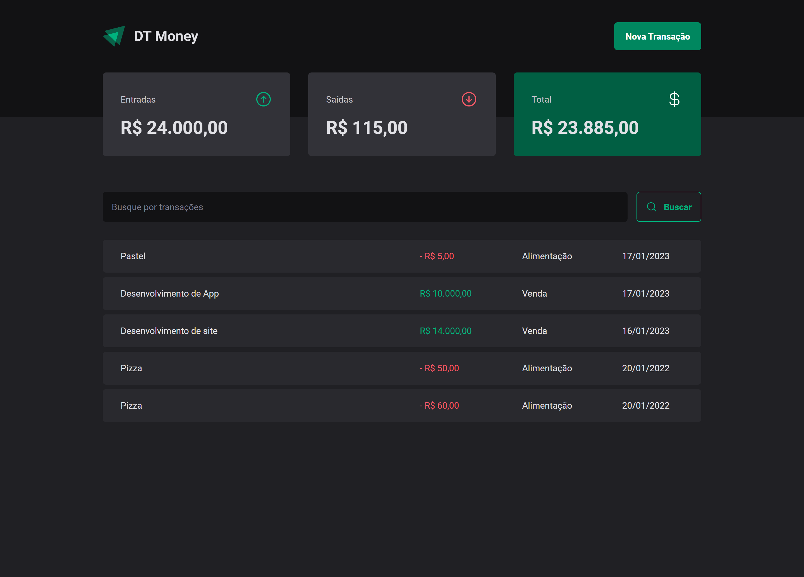

# DT Money

<!---Esses são exemplos. Veja https://shields.io para outras pessoas ou para personalizar este conjunto de escudos. Você pode querer incluir dependências, status do projeto e informações de licença aqui--->



<br />

## 💻 Sobre

Este projeto é um aplicativo de gerenciamento financeiro chamado Dt Money. Ele foi desenvolvido com React e Vite, e tem como objetivo ajudar os usuários a gerenciar suas finanças pessoais. O aplicativo permite que os usuários adicionem entradas e saídas de dinheiro, visualizem seu saldo atual e histórico de transações. O projeto não possui APIs cadastradas, mas utiliza o json-server para simular um servidor a partir de um arquivo json. Isso permite que os usuários acessem e gerenciem suas informações financeiras de forma fácil e segura. O objetivo do projeto é proporcionar uma experiência de gerenciamento financeiro fácil e acessível para os usuários.

<br />

## 🖱 Pré-requisitos

Antes de começar, verifique se você atendeu aos seguintes requisitos:

- Você instalou a versão mais recente de `node / npm / yarn`
  <br />

## ☕ Usando o DT Money

Para usar o DT Money, siga estas etapas:

```
git clone https://github.com/SidneyRoberto9/dt-money

yarn ou npm i

yarn start ou npm start

apos isso devemos inicar o servidor do Json-Server

yarn dev:server ou npm run dev:server
```
